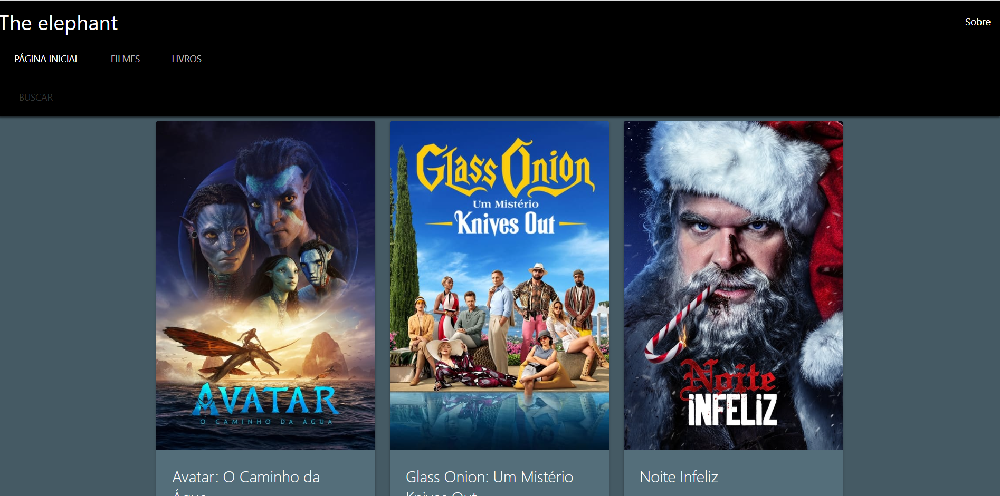

# Trabalho-Individual-WebService

# The elephant
O projeto foi criado com base na proposta de trabalho apresentada na disciplina de WebServices, consiste em consumir e combinar os dados de no mínimo duas API's. O projeto tem o intuito de fornecer ao usuário informações sobre filmes e livros com base em sua busca, para isso foram utilizadas as API's Google Books e TMDB.

* [Google Books](https://developers.google.com/books/docs/overview)
* [TMDB](https://www.themoviedb.org/)

# Execução
A execução é simples visto que o projeto é um webapp que utiliza apenas JavaScript, CSS e HTML, basta baixar o repositório e abrir o arquivo index.html em seu navegador

# Imagens do projeto

#Vídeo de apresentação

* [Apresentação Trabalho Individual](https://youtu.be/AZG1CAp4Qdc)

#GitHub Pages

* [The elephant](https://carenferreira.github.io/Trabalho-Individual-WebService/index.html)
